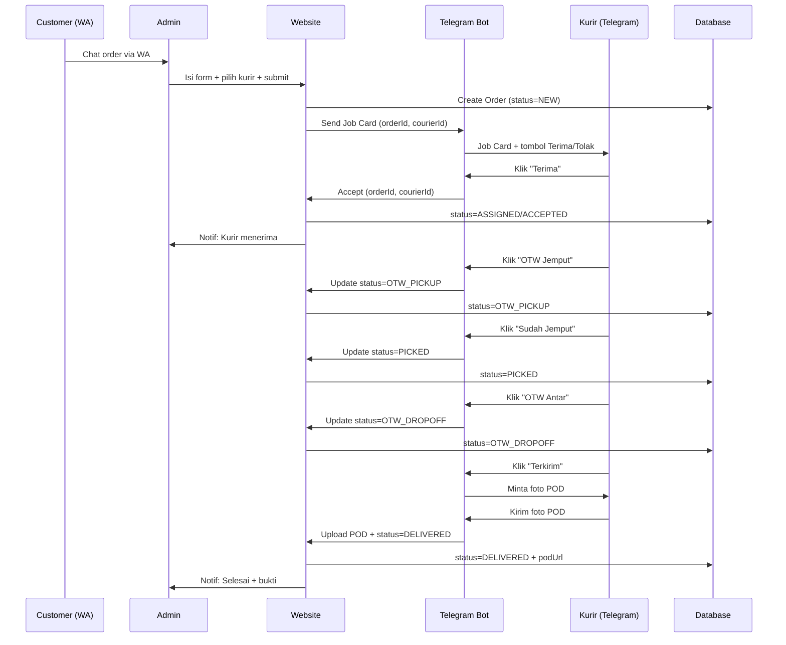
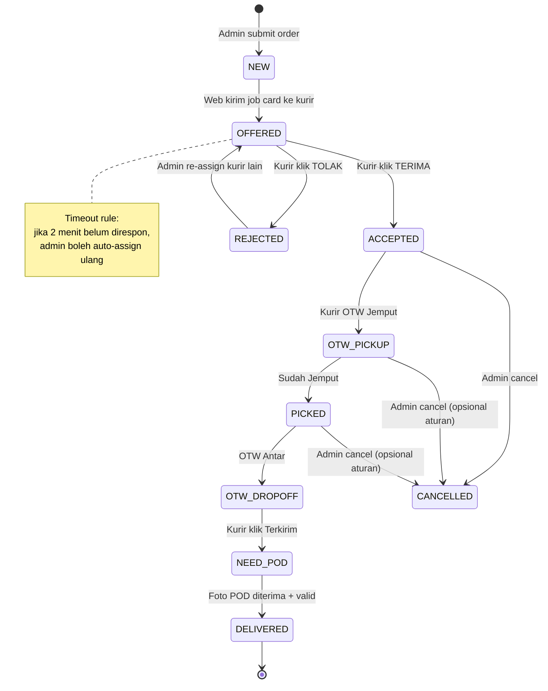

Siap. Ini **diagram lengkap + template bot Telegram** untuk **Ide 1: Web sebagai pusat (single source of truth), kurir full kerja via Telegram**.

---

```mermaid
flowchart LR
  U[Customer] -->|WA chat order| A[Admin]
  A -->|Input order + assign kurir| W[Website Admin Dashboard]
  W --> DB[(Database Orders)]
  W -->|Push notif job card| TB[Telegram Bot]
  TB -->|Job card + tombol aksi| C[Kurir (Telegram)]
  C -->|Accept/Reject + status updates| TB
  TB -->|Update status + upload POD| W
  C -->|Foto bukti (POD)| TB

  W -->|Realtime monitoring| A
  W -->|Optional: update ke customer| A
```

---

## 1) Diagram urutan (sequence) — dari dibuat sampai selesai



---

## 2) State machine status order (biar web + bot sinkron)



---

# 3) Template Bot Telegram (Ide 1)

## 3.1. Prinsip template

* Semua pesan kurir harus **pendek + actionable**.
* Semua tombol pakai **Inline Keyboard** (biar 1 tap).
* Semua update status **mengubah satu “Job Card” yang sama** (edit message) + kirim notifikasi singkat (opsional).

---

## 3.2. Onboarding kurir (link Telegram ↔ akun kurir)

**Goal:** kurir nggak perlu login web, tapi bot tahu dia “kurir siapa”.

### Opsi pairing paling gampang

1. Admin input **Telegram username / Telegram ID** kurir di dashboard.
2. Kurir chat bot `/start` → bot simpan `telegram_user_id`.
3. Dashboard menandai kurir “Connected ✅”.

**Template pesan /start**
**Bot → Kurir**

> Halo **{namaKurir}** 👋
> Akun kamu sudah terhubung dengan **Rayo Kurir** ✅
> Kalau ada order masuk, kamu akan dapat notifikasi di sini.
>
> Perintah cepat:
> `/orders` lihat order aktif
> `/help` bantuan

Jika belum terhubung:

> Halo! Untuk mulai, minta admin menghubungkan akun Telegram kamu ke sistem Rayo Kurir.
> Kirimkan ini ke admin: **ID Telegram kamu: {telegramId}**

---

## 3.3. Job Card (pesan utama saat order masuk)

**Bot → Kurir (Job Card)**

**🛵 ORDER BARU — #{orderCode}**
**Pickup (Desa):** {pickupVillage}
**Detail Pickup:** {pickupDetail}
**Dropoff (Desa):** {dropoffVillage}
**Detail Dropoff:** {dropoffDetail}

**Layanan:** {Regular/Express}
**Estimasi Ongkir:** Rp{total}

* D1 Jemput: Rp{d1}
* D2 Antar: Rp{d2}
* Add-on: Rp{addons}

**Catatan:** {notes / "-"}

**⏱️ Respon cepat ya.**

**Inline buttons (row-by-row):**

1. ✅ **TERIMA**  |  ❌ **TOLAK**
2. 📍 **Lihat Lokasi** (jika ada link maps) | 📞 **Hubungi Admin**
3. ℹ️ **Detail** (optional: show breakdown lebih lengkap)

**Callback data (contoh standar):**

* `ord_accept:{orderId}`
* `ord_reject:{orderId}`
* `ord_maps:{orderId}`
* `ord_call_admin:{orderId}`
* `ord_detail:{orderId}`

---

## 3.4. Saat kurir klik TERIMA

**Bot → Kurir**

> ✅ Order **#{orderCode}** kamu terima.
> Update status lewat tombol di bawah.

**Edit Job Card (message yang sama) jadi “ORDER AKTIF”**
**🟢 ORDER AKTIF — #{orderCode}**
Pickup: {pickupVillage} → Dropoff: {dropoffVillage}
Layanan: {Regular/Express} • Estimasi: Rp{total}

**Buttons status:**

1. 🚦 **OTW JEMPUT**
2. 📦 **SUDAH JEMPUT**
3. 🏁 **OTW ANTAR**
4. ✅ **TERKIRIM**
5. ⚠️ **KENDALA** (opsional, untuk eskalasi)

Callback:

* `ord_status:otw_pickup:{orderId}`
* `ord_status:picked:{orderId}`
* `ord_status:otw_dropoff:{orderId}`
* `ord_status:delivered:{orderId}`
* `ord_issue:{orderId}`

**Rule penting (server-side):**

* Hanya kurir assigned yang boleh update.
* Status harus berurutan (nggak bisa loncat dari OTW Jemput ke Terkirim).

---

## 3.5. Saat kurir klik TOLAK

**Bot → Kurir**

> ❌ Oke, order **#{orderCode}** kamu tolak.
> Pilih alasannya:

**Buttons alasan:**

* 🚫 Jauh / bukan area
* 🛵 Motor bermasalah
* ⏱️ Sedang handle order lain
* 🤒 Berhalangan
* ✍️ Lainnya (ketik)

Callback contoh:

* `ord_reject_reason:far:{orderId}`
* `ord_reject_reason:busy:{orderId}`
* `ord_reject_reason:other:{orderId}`

Kalau pilih “Lainnya”:
**Bot → Kurir**

> Tulis alasan singkat (max 1 kalimat).

---

## 3.6. Template update status (tiap klik tombol)

Setiap kali kurir klik status, bot kirim toast-like message:

* “✅ Status diupdate: OTW Jemput”
* dan **edit Job Card** menampilkan status terbaru + timestamp.

**Contoh edit Job Card (ringkas):**
**🟢 ORDER AKTIF — #{orderCode}**
Status: **OTW JEMPUT** (12:41)
Pickup: {pickupVillage} • Dropoff: {dropoffVillage}
Estimasi: Rp{total} • Express: {Ya/Tidak}

Buttons tetap sama, tapi yang sudah lewat bisa di-disable (opsional).

---

## 3.7. Flow “Terkirim” wajib foto POD

Saat klik **✅ TERKIRIM**:
**Bot → Kurir**

> Mantap ✅
> Sekarang kirim **foto bukti (POD)** ya.
> Tips: foto jelas (barang + penerima / lokasi depan rumah) 🙂

Bot set state: `awaiting_pod_photo=true` untuk orderId ini.

### Saat foto masuk

**Bot → Kurir**

> ✅ Foto bukti diterima. Order **#{orderCode}** selesai. Terima kasih! 🙏

### Jika kurir kirim selain foto

**Bot → Kurir**

> Aku butuh **foto** ya 🙏
> Kirim foto bukti untuk menyelesaikan order **#{orderCode}**.

### Jika kurir kirim 2 foto

* Simpan 2-2nya, tandai `podUrls[]`, tampilkan “Foto 1/2 tersimpan”.

---

## 3.8. Template “KENDALA” (opsional tapi sangat berguna)

**Bot → Kurir**

> ⚠️ Kendala apa?
> Buttons:

* 📵 Penerima tidak bisa dihubungi
* 📍 Alamat tidak ketemu
* ⏳ Nunggu lama (antre/menunggu)
* 🛑 Rute terhalang
* ✍️ Lainnya (ketik)

Setelah pilih:
**Bot → Kurir**

> Oke, admin sudah dikabari.
> Tambahkan detail singkat (opsional).

**Bot → Admin (notif)**

> ⚠️ Kendala order #{orderCode}
> Kurir: {namaKurir}
> Kendala: {jenis}
> Catatan: {detail}

---

# 4) Template notifikasi untuk Admin (di web / opsional via Telegram admin)

Kamu bisa pilih: admin cukup lihat dashboard, atau pakai “Admin Bot”/group.

**Event notif yang penting:**

1. Kurir TERIMA / TOLAK
2. Status berubah (OTW Jemput, Sudah Jemput, OTW Antar, Terkirim)
3. POD uploaded
4. Kendala

**Contoh format singkat**

> ✅ Kurir {namaKurir} menerima order #{orderCode}
> Pickup: {pickupVillage} → Dropoff: {dropoffVillage}

> 📸 POD masuk — order #{orderCode}
> Link: {podUrl}

---

# 5) Aturan elegan biar sistem “enak” dipakai

1. **Satu pesan Job Card** diedit terus (kurir nggak scroll panjang).
2. **Timeout OFFERED**: mis. 2 menit belum respon → admin bisa assign ulang.
3. **Lock status**: urutan status tidak bisa loncat.
4. **POD wajib**: order belum “selesai” sebelum foto masuk (atau ada override admin).
5. **Anti double-accept**: kalau sudah diambil kurir lain → tombol berubah jadi “Order sudah ditangani”.

---


# Rayo Kurir — Spec Rework “Quick Add Order” (Web Admin + Web Kurir)
Versi: v1.0 (Plan + Spec)  
Catatan: **Ongkir tetap input manual** (tidak otomatis). Fokus: form lebih cepat, minim salah, enak dipakai admin & kurir di web.

---

## 0) Baseline form saat ini (yang sudah ada di web)
Modal **Quick Add Order** sekarang berisi field:
- Nama Pengirim, Nomor WhatsApp :contentReference[oaicite:0]{index=0}
- Alamat Pickup, Alamat Dropoff :contentReference[oaicite:1]{index=1}
- Jenis Order, Service Type :contentReference[oaicite:2]{index=2}
- Ongkir (Rp) :contentReference[oaicite:3]{index=3}
- Dana Talangan (Rp) :contentReference[oaicite:4]{index=4}
- Nominal COD (Rp) :contentReference[oaicite:5]{index=5}
- Cara Bayar Ongkir (Non-COD/COD) :contentReference[oaicite:6]{index=6}
- Catatan, Assign Kurir (opsional) :contentReference[oaicite:7]{index=7}
- Tombol: Batal / Tambah & Lanjut / Simpan & Tutup :contentReference[oaicite:8]{index=8}  
- Hint: isi COD hanya jika ada barang titipan :contentReference[oaicite:9]{index=9}

---

## 1) Tujuan redesign (tanpa otomatisasi ongkir)
1. **Form makin cepat diisi** (admin input order dari WA bisa < 45 detik).
2. **Minim salah input**: validasi WA, wajib patokan alamat, logika COD vs talangan jelas.
3. **Satu form dipakai admin & kurir**, tapi dengan **role-based UI** (kurir tidak lihat field yang tidak perlu).
4. Meski ongkir manual, UI tetap “mengunci” konsep baru: ada **Service Type / Add-on** sebagai data (tanpa hitung otomatis), supaya laporan & kebijakan konsisten.

---

## 2) Konsep UI baru (tetap modal, tapi rapi)
Modal dibagi section (scroll tetap nyaman):

### A. Customer
- Nama Pengirim*
- Nomor WhatsApp*

### B. Rute
- Pickup (alamat + patokan)*
- Dropoff (alamat + patokan)*

### C. Layanan
- Jenis Order*
- Service Type* (Regular / Express)
- Add-on opsional (checkbox): Return/PP, Bulky/Heavy, Waiting fee (lihat “Detail biaya tambahan”)

### D. Keuangan
- Ongkir (Rp)* (manual)
- Dana Talangan (Rp) (opsional)
- Nominal COD (Rp) (opsional)
- Cara Bayar Ongkir* (Non-COD / COD)

### E. Operasional
- Catatan
- Assign kurir (opsional saat create)

**Perubahan utama**: layout rapi, tapi **tetap mempertahankan field inti** yang sudah ada sekarang :contentReference[oaicite:10]{index=10}.

---

## 3) Spec Field (lengkap)
> Format: Nama field — type — required? — default — aturan/validasi — siapa yang bisa edit

### A) Customer
1) **Nama Pengirim**
- type: text + autocomplete
- required: ✅
- placeholder: “Ketik nama untuk autocomplete…” :contentReference[oaicite:11]{index=11}
- validasi: min 2 char
- edit: Admin ✅, Kurir ❌

2) **Nomor WhatsApp**
- type: tel
- required: ✅
- placeholder: 08123456789 :contentReference[oaicite:12]{index=12}
- validasi:
  - normalisasi: “08xxxx” → simpan “62xxxx”
  - minimal 10 digit
- edit: Admin ✅, Kurir ❌

---

### B) Rute
3) **Alamat Pickup**
- type: textarea (2–3 baris)
- required: ✅ :contentReference[oaicite:13]{index=13}
- aturan: wajib ada patokan (contoh: “dekat masjid / gang buntu / depan toko…”)
- edit: Admin ✅, Kurir ❌ (kecuali fitur “koreksi alamat” dengan log)

4) **Alamat Dropoff**
- type: textarea (2–3 baris)
- required: ✅ :contentReference[oaicite:14]{index=14}
- aturan: wajib patokan
- edit: Admin ✅, Kurir ❌

**Upgrade opsional (tanpa hitung ongkir):**
- field “Link Maps” (optional) untuk pickup & dropoff (string URL)
- tombol kecil “Tempel dari Google Maps”

---

### C) Layanan
5) **Jenis Order**
- type: select
- required: ✅ :contentReference[oaicite:15]{index=15}
- contoh opsi (kamu bisa sesuaikan):
  - Antar Barang
  - Jemput Barang
  - Titip Beli
  - Dokumen
  - Lainnya

6) **Service Type**
- type: select
- required: ✅ :contentReference[oaicite:16]{index=16}
- opsi minimal:
  - Regular
  - Express (+Rp2.000) *(catatan: tidak otomatis menambah ongkir; hanya label & data)*

7) **Add-on (opsional)**
- type: checkbox group (disarankan collapsible “Biaya tambahan”)
- default: off
- opsi:
  - Return/PP (+60%) *(data saja; admin tetap input total ongkir manual)*
  - Bulky (+2.000)
  - Heavy/Repot (+5.000)
  - Waiting fee (aktifkan → muncul input nominal)

> Tujuan add-on: buat **tracking & konsistensi** (tanpa mengotak-atik angka ongkir otomatis).

---

### D) Keuangan
8) **Ongkir (Rp)**
- type: currency input
- required: ✅ :contentReference[oaicite:17]{index=17}
- aturan:
  - minimal Rp3.000 (validasi)
  - *tidak dihitung otomatis*
- edit: Admin ✅, Kurir ❌ (kecuali role “lead kurir” kalau kamu butuh)

9) **Dana Talangan (Rp)**
- type: currency input
- required: ❌ :contentReference[oaicite:18]{index=18}
- default: 0
- aturan:
  - hanya muncul/ditonjolkan jika Jenis Order = Titip Beli (atau tetap ada tapi diberi label)
  - status tracking: `talanganDiganti = true/false` (checkbox)
- edit: Admin ✅, Kurir ✅ (kurir bisa update “Talangan Diganti” saat customer bayar)

10) **Nominal COD (Rp)**
- type: currency input
- required: ❌ :contentReference[oaicite:19]{index=19}
- default: 0
- aturan:
  - isi jika ada barang titipan merchant
  - label “Kurir wajib setor ke toko”
- edit: Admin ✅, Kurir ✅ (kurir update status setoran)

11) **Cara Bayar Ongkir**
- type: radio/select
- required: ✅ :contentReference[oaicite:20]{index=20}
- opsi:
  - Non-COD (dibayar langsung) :contentReference[oaicite:21]{index=21}
  - COD (digabung setoran COD) :contentReference[oaicite:22]{index=22}

**Rule validasi penting (biar gak salah)**
- Jika `Cara Bayar Ongkir = COD` tapi `Nominal COD = 0` → tampilkan warning:
  - “Mode COD biasanya dipakai kalau ada setoran COD. Pastikan ini benar.”
- Jika `Nominal COD > 0` tapi Cara Bayar Ongkir masih Non-COD → warning:
  - “Ada COD barang, tapi ongkir dibayar langsung—pastikan sesuai kesepakatan.”

Hint existing tetap dipertahankan & diperjelas :contentReference[oaicite:23]{index=23}.

---

### E) Operasional
12) **Catatan**
- type: textarea
- required: ❌ :contentReference[oaicite:24]{index=24}
- contoh: “Titip beli: Indomaret, beli susu 2, roti 1”

13) **Langsung Assign ke Kurir**
- type: select
- required: ❌ :contentReference[oaicite:25]{index=25}
- aturan:
  - jika kosong → status order “BARU”
  - jika terisi → status “ASSIGNED” + masuk antrian kurir

---

## 4) Role-based UI (Admin vs Kurir) — wajib
### Admin (web)
- Bisa create/edit semua field order
- Bisa assign/re-assign kurir
- Bisa override status (mis. cancel, koreksi data)

### Kurir (web)
Kurir **tidak perlu lihat modal create**.
Kurir butuh 2 layar saja:

1) **Assigned Orders (list)**
- menampilkan: Order ID, pickup ringkas, dropoff ringkas, ongkir, COD/talangan badge, status.

2) **Order Detail (aksi)**
- Tombol status cepat:
  - ACC / Tolak (jika baru assigned)
  - OTW Jemput
  - Sudah Jemput
  - OTW Antar
  - Terkirim (wajib upload foto)
- Upload foto bukti (POD)
- Update: Talangan Diganti (checkbox) & Setor COD (checkbox) bila relevan

---

## 5) Status & aturan transisi (web admin + web kurir)
### Status Order (minimal)
- BARU (created belum assign)
- ASSIGNED (admin pilih kurir)
- ACCEPTED (kurir acc)
- OTW_PICKUP
- PICKED
- OTW_DROPOFF
- DELIVERED (selesai + POD)
- CANCELLED

### Aturan penting
- Kurir hanya bisa update status untuk order yang di-assign ke dirinya.
- Status harus berurutan (tidak loncat).
- DELIVERED butuh **POD minimal 1 foto** (kecuali admin override dengan alasan).

---

## 6) Data model (ringkas tapi siap implement)
### Order (field inti)
- id, createdAt, createdBy (admin)
- senderName, senderWa
- pickupAddress, dropoffAddress
- orderType, serviceType
- addons: { express, returnPP, bulky, heavy, waitingFeeEnabled }
- ongkirTotal (number) **manual**
- waitingFeeAmount (number, optional)
- danaTalangan, talanganDiganti (boolean)
- nominalCOD, codSettled (boolean)
- payOngkirMethod (NON_COD | COD)
- notes
- assignedCourierId (nullable)
- status
- podPhotos: [{url, uploadedAt, uploadedBy}]
- auditLog: [{event, by, at, meta}]

---

## 7) UX microcopy (bikin form “enak”)
- Ongkir:
  - “Isi total ongkir manual. Minimal Rp3.000.”
- Dana Talangan:
  - “Bukan pendapatan. Centang ‘Talangan Diganti’ setelah customer mengganti.” :contentReference[oaicite:26]{index=26}
- Nominal COD:
  - “Bukan pendapatan. Kurir wajib setor ke toko. Jika tidak ada COD → isi 0.” :contentReference[oaicite:27]{index=27}
- Hint bawah dipertahankan (ditambah styling supaya kebaca) :contentReference[oaicite:28]{index=28}

---

## 8) Rekomendasi library (kalau kamu pakai Next.js/React)
> Ini untuk bikin form makin stabil & rapi (tanpa ngubah sistem ongkir jadi otomatis).
- UI: shadcn/ui (Dialog, Select, Textarea, Badge, Alert, Tooltip)
- Form: react-hook-form + zod (validasi conditional: COD/talangan)
- Upload: uploadthing / custom S3-compatible (atau storage yang kamu pakai sekarang)
- Table/list: @tanstack/react-table (Orders list)
- State server: react-query (optional)

---

## 9) Plan eksekusi (step-by-step, aman)
### Step 1 — Rapikan modal “Quick Add Order”
- Pecah section (Customer / Rute / Layanan / Keuangan / Operasional)
- Tambah validasi wajib + warning rule COD/talangan
- Pertahankan tombol: Batal / Tambah & Lanjut / Simpan & Tutup :contentReference[oaicite:29]{index=29}

### Step 2 — Buat “Kurir View” yang super sederhana
- Assigned list + Detail order + tombol status + upload POD
- Pastikan mobile friendly (kurir pakai HP)

### Step 3 — Audit log & checklist settlement
- Talangan diganti, COD disetor, POD masuk
- Dashboard ringkasan “COD Outstanding” tetap konsisten :contentReference[oaicite:30]{index=30}

### Step 4 — Quality gates (wajib)
- Tidak bisa DELIVERED tanpa POD (kecuali override)
- Tidak bisa set COD method tanpa warning jika COD=0
- Nominal angka tersimpan sebagai number (bukan string)

---

## 10) Acceptance Criteria (kriteria selesai)
1. Admin bisa bikin order dari WA tanpa bingung & minim salah input (validasi jelas).
2. Ongkir tetap manual, tetapi data service/add-on tercatat untuk konsistensi.
3. Kurir bisa: acc → update status → upload POD → selesai tanpa perlu buka modal admin.
4. COD/talangan tracking jelas: outstanding bisa dipantau.
5. Semua perubahan status tercatat di audit log.


# Rayo Kurir — Telegram Bot Kurir (Spec Eksekusi)
Versi: v1.0  
Mode: **Kurir pakai Telegram**, Web tetap jadi sumber data & kontrol utama.  
Catatan penting:  
- **Token bot Telegram hanya bisa dibuat lewat BotFather (1x saja)**. Itu requirement Telegram.  
- Setelah token ada, **semua tombol/command/menu bisa di-set via terminal** (Bot API: `setMyCommands`, `setWebhook`, dsb).  
- “Button” yang dimaksud di chat Telegram itu **Inline Keyboard** → dibuat full lewat kode, **tanpa BotFather**.

---

## 1) Tujuan & Scope
### Tujuan
- Kurir menerima order, ACC/REJECT, update status, dan upload foto POD (bukti) langsung di Telegram.
- Web backend tetap menyimpan status order, POD, dan audit log.

### Scope fitur (kurir)
- Pairing akun kurir ↔ telegram user
- Terima/Tolak order
- Update status berurutan
- Upload POD (minimal 1 foto) saat “Terkirim”
- Lihat daftar order aktif
- Kendala (opsional) untuk eskalasi ke admin

---

## 2) Stack yang direkomendasikan (paling praktis)
### Opsi A (disarankan): Node.js + TypeScript + Telegraf
- Runtime: Node 18+
- Library bot: `telegraf`
- HTTP client: `axios`
- Env: `dotenv`
- Logger: `pino` / `winston`
- Storage state sementara: in-memory (MVP) / Redis (lebih aman)

> Kalau agent AI kamu biasa pakai Node/Next.js, ini paling nyambung.

### Opsi B: Python + aiogram
- Alternatif kalau tim kamu lebih nyaman Python.

(Spec di bawah ditulis netral, tapi contoh implementasi mengarah ke Telegraf.)

---

## 3) Konsep arsitektur
### 3.1. Komponen
1) **Web Backend (existing)**  
   - Menyimpan order, kurir, status, POD, audit log  
   - Menyediakan endpoint “bot integration”

2) **Telegram Bot Service (baru)**  
   - Long polling atau webhook
   - Menerima callback tombol & foto
   - Memanggil Web Backend untuk update status & upload POD

3) **Database (existing)**  
   - Minimal butuh mapping kurir ↔ telegramUserId / chatId

### 3.2. Keamanan
- Bot service memanggil backend pakai header:
  - `Authorization: Bearer <BOT_SHARED_SECRET>`
- Backend hanya menerima request bot jika secret cocok.
- Semua aksi kurir divalidasi:
  - telegram user harus terhubung ke courierId
  - courierId harus match assignedCourierId pada order
  - status update harus berurutan

---

## 4) Data model minimal (di backend)
### Courier
- id
- name
- telegramUserId (number) nullable
- telegramChatId (number) nullable
- isActive (boolean)

### Order (ringkas)
- id, code
- senderName, senderWa
- pickupAddress, dropoffAddress
- orderType, serviceType
- ongkirTotal (manual)
- danaTalangan, nominalCOD
- payOngkirMethod
- notes
- assignedCourierId
- status (enum)
- podPhotos: [{url, fileId, uploadedAt, uploadedBy}]
- auditLog: [{event, at, actorType, actorId, meta}]

---

## 5) State machine status (wajib konsisten dengan web)
Enum status minimal:
- NEW
- ASSIGNED  (admin pilih kurir)
- ACCEPTED  (kurir acc)
- OTW_PICKUP
- PICKED
- OTW_DROPOFF
- NEED_POD   (kurir klik “Terkirim”)
- DELIVERED  (POD masuk)
- REJECTED
- CANCELLED

Aturan transisi:
- ASSIGNED → ACCEPTED / REJECTED
- ACCEPTED → OTW_PICKUP → PICKED → OTW_DROPOFF → NEED_POD → DELIVERED
- DELIVERED wajib punya minimal 1 POD kecuali admin override (di web)

---

## 6) UX: Command & Menu (set via terminal, bukan BotFather)
### Commands (Telegram “/” commands)
- `/start` → onboarding/pairing
- `/orders` → daftar order aktif (assigned ke kurir)
- `/help` → bantuan singkat
- `/me` → info akun terhubung

> Commands ini bisa diset lewat Bot API `setMyCommands` (lihat bagian 12).

---

## 7) Pairing akun kurir ↔ Telegram
### Mode pairing yang disarankan (paling simple dan aman)
- Admin sudah punya data kurir di web.
- Kurir chat bot `/start`, bot tampilkan:
  - `telegramUserId` dan “Kode Pairing” (OTP 6 digit)
- Kurir kirim OTP itu ke admin (atau admin masukkan di web).
- Admin input OTP di web → backend mengikat `telegramUserId/chatId` ke courierId.

#### Flow detail
1) Kurir: `/start`
2) Bot: “Ini kode pairing kamu: **834221** (berlaku 10 menit). Kirim ke admin.”
3) Admin input OTP di web: “Hubungkan Telegram Kurir”
4) Backend menyimpan telegramUserId & chatId kurir.
5) Bot: “✅ Akun kamu sudah terhubung.”

---

## 8) Template pesan & tombol (Inline Keyboard)
> Semua tombol adalah **Inline Keyboard** dibuat dari kode. Tidak ada “buat tombol” di BotFather.

### 8.1. Job Card (order masuk)
**Text:**
🛵 *ORDER BARU* — #{code}  
Pickup: *{pickupShort}*  
Dropoff: *{dropoffShort}*  
Layanan: *{serviceType}*  
Ongkir: *Rp{ongkir}*  
COD: *Rp{cod}* • Talangan: *Rp{talangan}*  
Catatan: {notesOrDash}

**Buttons:**
Row1: ✅ TERIMA | ❌ TOLAK  
Row2: 📍 Maps Pickup | 📍 Maps Dropoff  
Row3: 📞 Hubungi Admin | ℹ️ Detail

### 8.2. Setelah diterima (Order Aktif)
**Text:**
🟢 *ORDER AKTIF* — #{code}  
Status: *ACCEPTED*  
Pickup: {pickupShort} → Dropoff: {dropoffShort}  
Ongkir: Rp{ongkir}

**Buttons:**
Row1: 🚦 OTW JEMPUT  
Row2: 📦 SUDAH JEMPUT  
Row3: 🏁 OTW ANTAR  
Row4: ✅ TERKIRIM (minta foto)  
Row5 (opsional): ⚠️ KENDALA

### 8.3. Saat klik “TERKIRIM”
Bot mengubah status order → NEED_POD lalu minta foto:
“✅ Sip. Sekarang kirim *foto bukti (POD)* ya (minimal 1 foto).”

---

## 9) Callback data schema (wajib konsisten & mudah di-parse)
Format umum:
- `rk:<action>:<orderId>[:<extra>]`

Daftar action:
- `acc` → accept
- `rej` → reject (lanjut pilih alasan)
- `rejr` → reject reason
- `st` → status update
- `maps` → maps link
- `detail` → detail ringkas
- `issue` → kendala type

Contoh:
- `rk:acc:ORDER123`
- `rk:st:ORDER123:OTW_PICKUP`
- `rk:st:ORDER123:DELIVERED` (diubah jadi NEED_POD dulu)
- `rk:rejr:ORDER123:busy`

---

## 10) Kontrak API Backend (yang harus disiapkan agar bot jalan)
> Semua endpoint menerima header:
- `Authorization: Bearer BOT_SHARED_SECRET`
- body JSON
- response JSON

### 10.1. Pairing
**POST** `/bot/pair/request`
- input: `{ telegramUserId, telegramChatId, telegramUsername }`
- output: `{ pairingCode, expiresAt }`

**POST** `/bot/pair/confirm`
- input: `{ pairingCode, courierId }`
- output: `{ ok: true }`

**GET** `/bot/me?telegramUserId=...`
- output: `{ linked: true, courier: {id, name} }`

### 10.2. Push order ke kurir (dipanggil web)
**POST** `/bot/push/order`
- input: `{ orderId }`
- backend bot service kirim message ke chatId kurir (atau backend langsung panggil bot service)
- output: `{ ok: true, telegramMessageId }`

> Catatan: ini bisa 2 cara:
1) Web backend langsung panggil Telegram (punya token)  
2) Web backend panggil **Bot Service** (lebih bersih)

### 10.3. Accept/Reject
**POST** `/bot/order/accept`
- input: `{ orderId, courierId, telegramUserId }`
- output: `{ ok: true, status: "ACCEPTED" }`

**POST** `/bot/order/reject`
- input: `{ orderId, courierId, telegramUserId, reason }`
- output: `{ ok: true, status: "REJECTED" }`

### 10.4. Update status
**POST** `/bot/order/status`
- input: `{ orderId, courierId, telegramUserId, status }`
- output: `{ ok: true, status }`

Backend wajib cek:
- order.assignedCourierId == courierId
- transisi status valid

### 10.5. Upload POD
**POST** `/bot/order/pod`
- input: `{ orderId, courierId, telegramUserId, photos: [{fileUrl, telegramFileId}] }`
- output: `{ ok: true, status: "DELIVERED" }`

> Bot service akan:
1) ambil file dari Telegram `getFile` → file URL
2) download file → upload ke storage (punyamu)
3) kirim `fileUrl` ke backend

---

## 11) Perilaku bot (rules penting)
1) **Idempotent**: klik tombol dua kali tidak membuat double update.
2) **Order lock**: kalau order sudah di-accept kurir lain / status berubah, bot menolak aksi & edit pesan: “Order sudah tidak tersedia.”
3) **Status berurutan**: bot UI bisa men-disable tombol yang tidak valid, tapi backend tetap jadi penjaga utama.
4) **POD wajib**: status “Terkirim” di bot mengarah ke NEED_POD, bukan langsung DELIVERED.
5) **Multi order**: kurir bisa pegang beberapa order; `/orders` harus menampilkan list.
6) **Fallback**: jika bot gagal kirim pesan (kurir belum /start) → backend tandai “telegram_unreachable”, admin lihat di web.

---

## 12) Setup via terminal (tanpa BotFather untuk tombol/commands)
> BotFather tetap dibutuhkan **sekali** untuk token. Setelah itu semua pakai terminal.

### 12.1. Set commands via Bot API (terminal)
Ganti `BOT_TOKEN`.
```bash
curl -s -X POST "https://api.telegram.org/bot$BOT_TOKEN/setMyCommands" \
  -H "Content-Type: application/json" \
  -d '{
    "commands":[
      {"command":"start","description":"Mulai / pairing akun kurir"},
      {"command":"orders","description":"Lihat order aktif"},
      {"command":"me","description":"Info akun terhubung"},
      {"command":"help","description":"Bantuan penggunaan"}
    ]
  }'
````

### 12.2. Webhook (kalau mau webhook)

```bash
curl -s -X POST "https://api.telegram.org/bot$BOT_TOKEN/setWebhook" \
  -H "Content-Type: application/json" \
  -d '{"url":"https://domainmu.com/telegram/webhook"}'
```

> Alternatif paling gampang: long polling (tanpa webhook).

---

## 13) Spec implementasi Bot Service (Telegraf) — checklist agent AI

### 13.1. Environment variables

* `BOT_TOKEN=...`
* `BACKEND_BASE_URL=https://...`
* `BOT_SHARED_SECRET=...`
* `ADMIN_WA_LINK=https://wa.me/62xxxx` (optional)
* `STORAGE_UPLOAD_URL=...` (jika bot service upload file)
* `NODE_ENV=production`

### 13.2. Routes/Handlers bot

* `onStart(ctx)`

  * call backend `/bot/pair/request`
  * kirim pairing code / status linked

* `onCommandOrders(ctx)`

  * call backend `/bot/orders?telegramUserId=...`
  * tampilkan list (max 5) + tombol “Open”

* `onCallbackQuery(ctx)` parse `rk:*`

  * `acc` → POST `/bot/order/accept`
  * `rej` → tampil pilihan alasan (edit message)
  * `rejr` → POST `/bot/order/reject`
  * `st:*` → POST `/bot/order/status`

    * jika status = DELIVERED → ubah ke NEED_POD + set state “awaiting photo”
  * `maps` → kirim link Google Maps (kalau ada) atau “Tidak tersedia”
  * `detail` → tampilkan detail ringkas order

* `onPhoto(ctx)`

  * cek state “awaiting_pod_photo for orderId”
  * ambil telegram fileId → `getFile` → download
  * upload ke storage
  * POST `/bot/order/pod`

### 13.3. Penyimpanan state sementara (MVP)

Minimal in-memory map:

* `awaitingPodPhoto[telegramUserId] = { orderId, expiresAt }`
* expire 15 menit

Lebih aman: Redis (kalau service restart tidak hilang).

---

## 14) Template UI list order (/orders)

**Bot → Kurir**
📋 *Order Aktif Kamu*

1. #{code} — {pickupVillage} → {dropoffVillage} (Status: {status})
2. ...

Setiap item punya tombol:

* “Buka #code” → callback `rk:detail:ORDERID`

Di detail tampil tombol status sesuai status terkini.

---

## 15) Error messages (biar elegan)

* “❌ Aksi gagal: order sudah di-cancel.”
* “❌ Kamu tidak berhak update order ini.”
* “⚠️ Status tidak valid. Ikuti urutan: OTW Jemput → Sudah Jemput → OTW Antar → Terkirim.”
* “📸 Kirim foto dulu untuk menyelesaikan order.”

---

## 16) Terminal scaffold (untuk agent AI bikin cepat)

### Node + TS + Telegraf (contoh struktur)

```
rayo-kurir-bot/
  src/
    index.ts
    bot.ts
    api.ts
    keyboards.ts
    templates.ts
    state.ts
    upload.ts
  .env
  package.json
  tsconfig.json
```

### Command awal (terminal)

```bash
mkdir rayo-kurir-bot && cd rayo-kurir-bot
npm init -y
npm i telegraf axios dotenv pino
npm i -D typescript ts-node @types/node
npx tsc --init
```

Run dev:

```bash
npx ts-node src/index.ts
```

---

## 17) Syarat “siap produksi”

* Logging request/response (tanpa bocorin secret)
* Retry upload POD (jika storage down)
* Rate limit sederhana (mencegah spam klik)
* Audit event di backend (accept/reject/status/pod)

---

## 18) Deliverables yang harus dibuat agent AI

1. Bot Service (Telegraf) lengkap handler + inline keyboards
2. Parser callback data
3. Integrasi backend API contract (endpoint sesuai bagian 10)
4. Mekanisme state “awaiting POD photo”
5. Script terminal untuk set commands (`setMyCommands`)
6. Dokumentasi env + cara run

---

Kalau kamu bilang backend-mu sekarang pakai apa (Supabase/Firebase/Laravel/Express), aku bisa sesuaikan **kontrak endpoint** + contoh payload persis sesuai struktur DB-mu biar agent AI tinggal gas tanpa nebak-nebak.

```
::contentReference[oaicite:0]{index=0}
```
